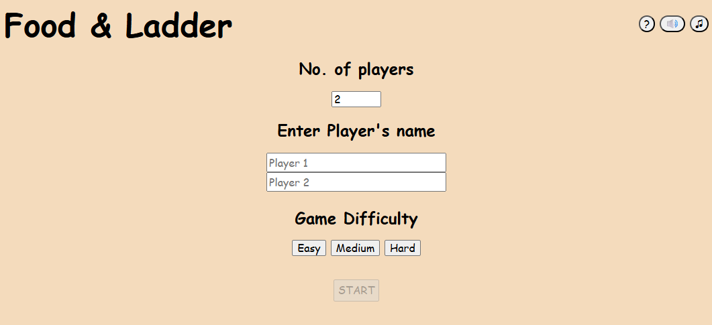
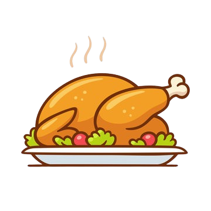

# Developing a Game - Food & Ladder

## Project Brief

### MVP - Minimum Viable Product

- Use Javascript DOM manipulation techniques
- Built with HTML, CSS and JavaScript
- UI/UX: Use flexbox/ Grid/ CSS framework for page layout design
- Git and GitHub: Hosted on Github pages and commits to Github frequently
- Be displayed in the browser
- Have a win/lose condition.

## Timeframe

1 weeks

## Technologies & Tools Used

- HTML
- CSS
- JavaScript
- Git & GitHub

## Description

This is a classic Snake and Ladder game with food theme on it. The game was designed and implemented using HTML, CSS, and Javascript while attending the Software Engineering bootcamp at General Assembly.

I chose to recreate this game as this was one of the traditional board games that I used to play when i was young, and it can only be played when friends are around. Hence, i decided to take this opportunity to recreate this game as an online platform so that I can play with friends remotely.

In this game, you are allowed to choose the number of players, input your name ang select the difficulty mode of the game. By increasing the level of difficulty, there will be more TRAPS and LADDERS render on the board. 
 

## WireFrame

Before coding the game, I planned out the design and the possible logic for the game. This helps to break down the project into manageable parts and also plan out the possible codes/functions needed. 

## How To Play

1. Firstly, you have to decide the number of players and input their names accordingly. If there are no names provided, the system will assign them the default names.
2. Next, you are required to choose the game mode before starting the game.
3. Players can read the game rules at the top right of the page.
4. Press "START" button to start the game.
5. Players take turns rolling a six-sided dice.

6. Ladders and traps:

   - Chicken (aka. ladder): If your avatar land on a "Chicken" (a picture of a chicken on the board), it will be immediately move to the "Muscle chicken" land. 
      -- climb up to -->
     
   - Rotten food (aka. snake): If your avatar land on a "Rotten food" (a picture of a rotten food on the board), it will be immediately drop down to the "Toilet" land. 
      <-- fall back to -- 

7. How to win: The first player to reach the final square wins the game. 
   

## Key Learning

This game is my very first attempt on coding, there are quite abit of hardcoded codes in the beginning stage of the game creation. However, I have decided to continue to work on the code until the basic features of the game is fully functional, then I move on to fine-tuning my codes by breaking down it into smaller functions, and some can even be reused for certain features (e.g., dynamically generate board function can be apply on starting the game and restarting the game).

Although snake and ladder is not a very complicated game to develop, but for a beginner, who learnt programming for 2 weeks (upon developing this game), have difficulty doing it. Therefore, I'm glad that through this project, it strongly enhanced my understanding of the following:

- Understanding objects that are needed for my game
- Using global data that can be used to keep track of the game state
- Debugging errors via logging messages
- Creating functions that can be reused

## Future Developments / Improvements

As JavaScript is relatively new to me, and some of the features that planned during the brainstorming phase did not incorporate into the current version. If there would be a future development on this game, I would like to improve and implement the following:

1. Refactoring the code in a shorter and more independent way.
2. Adding sound effects and background music for the game
3. Players will need to roll the exact number to get you to the last land. If the player rolls a number that is higher than needed to land the last land, player will bounce back accordingly.
4. To add more dice for bigger board
5. Players are allowed to choose their own avatar instead of system fixed avatar
6. Multiple players are allowed to join the game using different devices

## References

As I did not made reference to anyone's code when developing the game, hence, only documentation references are cited.

1. https://developer.mozilla.org/en-US/docs/Web/JavaScript/Reference/Statements/do...while

2. https://www.google.com/search?q=how+to+code+if+i+want+the+functions+to+run+if+the+function+return+is+false+in+javascript&sca_esv=d5c9e331663ca2e4&rlz=1C1CHBF_en-GBSG1158SG1158&ei=1aMpaNbCMOqhseMPwNi6kAM&ved=0ahUKEwiWgbSB1qyNAxXqUGwGHUCsDjIQ4dUDCBA&oq=how+to+code+if+i+want+the+functions+to+run+if+the+function+return+is+false+in+javascript&gs_lp=Egxnd3Mtd2l6LXNlcnAiWGhvdyB0byBjb2RlIGlmIGkgd2FudCB0aGUgZnVuY3Rpb25zIHRvIHJ1biBpZiB0aGUgZnVuY3Rpb24gcmV0dXJuIGlzIGZhbHNlIGluIGphdmFzY3JpcHRI6OcBUMYUWNHJAXAEeAGQAQCYAccBoAHADqoBBDE2Lja4AQzIAQD4AQGYAhGgAuYLwgIKEAAYsAMY1gQYR8ICBRAAGO8FwgIIEAAYgAQYogTCAgoQIRigARjDBBgKwgIIECEYoAEYwwTCAgQQIRgKmAMAiAYBkAYEkgcGMTIuNC4xoAeSTrIHBjEwLjQuMbgH4AvCBwYxLjE0LjLIByA&sclient=gws-wiz-serp

3. https://developer.chrome.com/blog/autoplay/

## Game Asset Atrributions

The game assets in this project does not belong to me. All rights belong to the original artists and owners.

1. Music track: A Little Explorer by Piki;
   Source: https://freetouse.com/music;
   Royalty Free Music for Videos (Safe)
